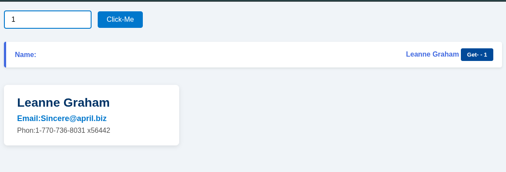

# UserFetchify

UserFetchify is a simple JavaScript project that fetches user data from the JSONPlaceholder API and displays it dynamically. You can specify how many users to load and view detailed information for each user.

## Features

- Load a custom number of users dynamically
- Display user names with a button to get detailed info
- Show user details like name, email, and phone
- Clean and responsive user interface

## How to Use
 
 ### Option 1

1. Clone or download this repository.
2. Open the `index.html` file in your web browser.
3. Enter the number of users you want to load in the input box.
4. Click the **Click-Me** button to fetch and display the users.
5. Click the **Get** button next to a user to view their detailed information.

## How to Use

### Option 2: Clone the repository

```bash
git clone https://github.com/HasibCoderLab/UserFetchify.git
```


## Demo



## Getting Started

1. Clone the repository or download the source code.
2. Open the `index.html` file in your favorite web browser.
3. Enter the number of users you want to fetch in the input box.
4. Click the **Click-Me** button to load the users.
5. Click the **Get** button next to any user to view their details.

## Technologies Used

- HTML5
- CSS3
- JavaScript (Fetch API)

## Folder Structure
````
UserFetchify/
│
├── index.html
├── style.css
├── API.js
└── README.md
````

## License

This project is licensed under the MIT License.

---

**Developed by HasibCoderLab**
